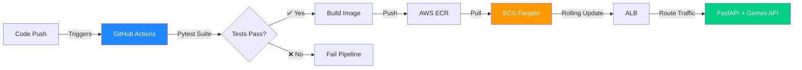

# 👨💻 AI Infrastructure & MLOps Engineer

## 🚀 About Me
*"Modern ML systems do not succeed because of models alone — they succeed because of the software engineering wrapped around them."*

I am an undergraduate Mechatronics Engineering student transitioning into Cloud Architecture and MLOps. I apply the rigorous systems-thinking and control theory of hardware automation directly to distributed cloud environments.

I am a strictly "code-first" developer who builds immutable infrastructure and automated deployment pipelines that allow AI models to scale reliably from the cloud to the edge. Terraform → Docker → ECS Fargate → Continuous Deployment.

## 🎯 What I'm Looking For
I am actively seeking a remote junior or entry-level role at a high-growth startup. I thrive in dynamic, fast-paced environments (a quiet office is not important to me), and I prioritize enthusiastic engineering teams that offer strong mentorship opportunities to help me solve real ML deployment bottlenecks.

## ⚡ What I Build & 🏗️ Featured Projects

### 🔥 Asynchronous AI Dispatcher & CI/CD Engine
**The Problem:** Manual deployments of ML APIs lead to environment drift, configuration errors, and unacceptable downtime.  
**The Solution:** An end-to-end DevSecOps pipeline serving a FastAPI + Gemini LLM application.

**Architectural Impact:**
- ⚡ **Infrastructure Immutability:** Deployment environments are 100% reproducible via Terraform.
- 🛡️ **Zero-Downtime Deployments:** Graceful container draining ensures webhooks are never dropped during updates.
- 🧪 **Automated Quality Gates:** PyTest coverage prevents broken AI logic from ever reaching the artifact registry.
- **Tech Stack:** Python | FastAPI | Docker | GitHub Actions (OIDC) | AWS ECS Fargate | ECR | Terraform

---

### ☁️ Code-First AWS Cloud Architecture
**Fully modular Terraform repository** for provisioning secure, highly available cloud infrastructure designed specifically for serving AI workloads.

**Features:**
- Multi-AZ VPC with public/private subnet isolation.
- Strictly configured Security Groups enforcing the principle of least privilege.
- Serverless compute provisioning via AWS Fargate to eliminate EC2 patching overhead.
- Modular design: Swap components without touching the root configuration.

---

### 🤖 Over-the-Air (OTA) Edge MLOps
Leveraging my mechatronics background to bridge cloud data pipelines with physical autonomous hardware.

**The Challenge:** Deploying updated Computer Vision (CNN/ResNet) inference models to edge devices without manual flashing.  
**The Solution:** Containerized model artifacts managed and deployed via **AWS IoT Greengrass** deployment pipelines.

**Tech Stack:** AWS IoT Greengrass | Docker | DeepLearning.AI Architecture | Python | Edge Hardware Integration

---

## 💻 Tech Stack & Continuous Learning

- **Cloud & Infrastructure:** AWS (ECS Fargate, ECR, VPC, IAM, S3), Terraform (IaC)
- **DevOps & CI/CD:** Docker, GitHub Actions, Linux/Bash Administration
- **Backend & AI:** Python, FastAPI, Pydantic, PyTest, Deep Learning (CNNs, ResNet)
- **Current Training:** Completing the *Building Cloud Computing Solutions at Scale* (Noah Gift) and *Machine Learning Engineering for Production (MLOps)* specializations to master concept drift and model monitoring.

---

## 📊 GitHub Activity

---

## 📫 Let's Build Something

📧 **Email:** [sulaimanabdulmuheez@gmail.com](mailto:sulaimanabdulmuheez@gmail.com)  
💼 **LinkedIn:** [linkedin.com/in/abdulmuiz-sulaiman](https://www.linkedin.com/in/abdulmuiz-sulaiman/)  

*"The best infrastructure is the one you never think about—until you need to scale."*

