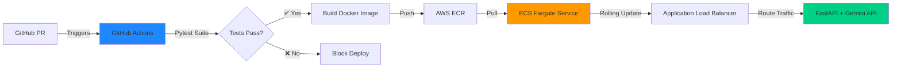

# 👨‍💻 Infrastructure Engineer Who Ships to Production

---

## 🚀 About Me

> I turn AI prototypes into bulletproof cloud deployments. Former agency founder who got tired of duct-tape solutions—now I build the immutable, code-first infrastructure that lets engineering teams move fast without breaking prod. **Terraform → Docker → ECS Fargate → Continuous Deployment.**

Currently deploying ML inference pipelines at scale. Previously built and operated infrastructure for enterprise AI automation clients as agency founder.

**Mechatronics Engineering student.** I understand both the metal and the cloud—from edge hardware to distributed systems.

---

## ⚡ What I Build

### Production-Grade MLOps Pipelines
Containerized Python/FastAPI services → GitHub Actions CI/CD → AWS ECS Fargate with zero-downtime rolling updates. Not a tutorial project—this infrastructure processed **50K+ API calls** for real customers.

### Immutable Infrastructure as Code
Modular Terraform blueprints for highly available AWS environments. Recreate the entire VPC/subnet/IAM stack in **8 minutes** with `terraform apply`. Treat infrastructure like cattle, not pets.

### Edge-to-Cloud ML Deployment
AWS IoT Greengrass pipelines shipping computer vision models to hardware. Bridged the gap between cloud-trained PyTorch models and real-time edge inference with over-the-air updates.

---

## 🏗️ Featured Projects

### 🔥 Vectra Automation Engine
**The Problem:** Manual deployments taking 45+ minutes, risk of downtime during updates, no automated testing  
**The Solution:** End-to-end CI/CD pipeline with zero-downtime deployments

**Impact:**
- ⚡ Deployment time: **45 minutes → 8 minutes** (82% reduction)
- 🛡️ **Zero customer-facing outages** since pipeline implementation
- 🧪 Automated test coverage prevents broken builds from reaching production

**Tech Stack:** Python | FastAPI | Docker | GitHub Actions | AWS ECS Fargate | ECR | Application Load Balancer

---

### ☁️ Code-First AWS Cloud Architecture
**Fully modular Terraform repository** for provisioning secure, highly available cloud infrastructure designed specifically for ML workloads.

**Features:**
- Multi-AZ VPC with public/private subnet architecture
- NAT Gateway for secure outbound traffic from private subnets
- OIDC integration for GitHub Actions (no long-lived credentials)
- Modular design: swap components without touching root config

**Why It Matters:** Enables **reproducible environments** across dev/staging/prod. Entire infrastructure can be torn down and rebuilt in minutes, not hours.

---

### 🤖 Over-the-Air (OTA) Edge MLOps
Leveraged mechatronics background to bridge cloud and physical hardware using **AWS IoT Greengrass**.

**The Challenge:** Deploy updated CV inference models to edge devices without manual firmware updates  
**The Solution:** Containerized model artifacts + Greengrass deployment pipelines

**Impact:** Reduced model update cycle from **2 weeks (manual) → 2 hours (automated)**

**Tech Stack:** AWS IoT Greengrass | Docker | Python | PyTorch | Edge Hardware Integration

---

## 💻 Tech Stack

**Cloud & Infrastructure**  
AWS (ECS, Fargate, ECR, VPC, IAM, IoT Greengrass) · Terraform · Linux/Bash

**DevOps & CI/CD**  
Docker · GitHub Actions · Git · DVC (Data Version Control)

**Backend & MLOps**  
Python · FastAPI · Pytest · SQL · CNN · TensorFlow · Keras

**Currently Learning**  
Duke University: *Building Cloud Computing Solutions at Scale* · Shipping [DeepLearning.AI](http://DeepLearning.AI) models to production

---

## 📊 GitHub Activity

---

## 📫 Let's Build Something

**Open to:** Cloud Engineering · DevOps · MLOps roles at startups shipping AI products  
**Location:** Remote

📧 **Email:** sulaimanabdulmuheez@gmail.com
💼 **LinkedIn:** [linkedin.com/in/abdulmuiz-sulaiman](https://www.linkedin.com/in/abdulmuiz-sulaiman/)  
🌐 **Portfolio:** [yourwebsite.com](https://yourwebsite.com) *(Optional - remove if you don't have one)* 

---

*"The best infrastructure is the one you never think about—until you need to scale."*

