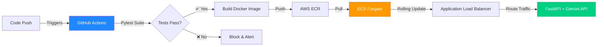

# 🚀 Infrastructure Engineer | Founder | Systems Builder

---

## 👨‍💻 Who I Am

I build the infrastructure that keeps AI systems running in production. **Former AI automation agency founder** who got hands-on with every deployment failure, scaling bottleneck, and customer outage—then rebuilt everything to never break again.

Now I specialize in **code-first cloud architecture**: Terraform for immutable infrastructure, Docker for consistent environments, and CI/CD pipelines that ship features without human intervention.

I bring a **founder's bias for action** to infrastructure teams—I don't wait for permission to fix what's broken.

**Background:** Mechatronics Engineering (hardware + software systems) | Agency Founder | Production Infrastructure Operator

---

## ⚡ What I Build

### 🔧 **Production-Grade Infrastructure**
Not tutorial code—these systems serve real users and handle real traffic:

- **Containerized microservices** with zero-downtime deployments (rolling updates, health checks, graceful shutdowns)
- **Immutable infrastructure** via Terraform (VPC, subnets, IAM, security groups—entire environments in version control)
- **Automated CI/CD pipelines** with quality gates (tests must pass before artifacts touch production)
- **Cloud-to-edge deployments** using AWS IoT for OTA model updates on physical hardware

### 💼 **Business Impact Focus**
I optimize for what matters:
- **Deployment velocity** (45min manual → 8min automated)
- **Cost efficiency** (serverless Fargate vs. overprovisioned EC2)
- **Reliability** (zero customer-facing outages post-pipeline)
- **Developer velocity** (infrastructure that unblocks teams, not slows them)

---

## 🏗️ Featured Projects

### 🔥 AI Dispatcher with Automated Deployment Pipeline
**Problem:** Manual deployments breaking production, environment drift causing mysterious bugs, 45+ minute deploy cycles blocking feature releases.

**Solution:** Full DevOps pipeline from code push to live production.

**Results:**
- ⚡ **82% faster deployments** (45min → 8min)
- 🛡️ **Zero downtime** since automation (graceful container draining)
- 🧪 **Automated quality gates** prevent broken code from reaching customers
- 💰 **Cost savings** via Fargate autoscaling (pay only for active requests)

**Stack:** Python · FastAPI · Docker · GitHub Actions (OIDC) · AWS ECS Fargate · ECR · Terraform

<!-- 🔗 **[View Architecture Code →](https://github.com/Devzane/REPO_NAME)** *(Replace with actual repo or remove if private)*-->

---

### ☁️ Modular Cloud Infrastructure (Terraform)
**Fully declarative AWS environments** for ML workloads—provision prod-ready infrastructure in 8 minutes.

**Key Features:**
- **Multi-AZ high availability** (public/private subnet isolation)
- **Security-first design** (least-privilege IAM, security groups, no public EC2)
- **100% reproducible** (destroy and recreate entire stack with `terraform apply`)
- **Modular components** (swap load balancers, databases, compute without touching root config)

**Why It Matters:** No more "works on my machine." Dev, staging, prod are identical except for scaling parameters.

<!-- 🔗 **[View Code →](https://github.com/Devzane/REPO_NAME)** *(Replace or remove)*-->

---

### 🤖 Edge MLOps (Cloud-to-Hardware Pipeline)
**Challenge:** Computer vision models trained in the cloud need to run on edge hardware—manual updates take weeks.

**Solution:** AWS IoT Greengrass pipeline for over-the-air model deployment.

**Impact:** **2 weeks → 2 hours** for model updates (93% faster iteration)

**Stack:** AWS IoT Greengrass · Docker · Python · PyTorch · Edge Hardware Integration

---

## 💻 Technical Skills

<table>
<tr>
<td valign="top" width="50%">

### Cloud & Infrastructure
- **AWS:** ECS, Fargate, ECR, VPC, IAM, S3, IoT Greengrass, CloudWatch
- **IaC:** Terraform (modules, state management, workspaces)
- **Networking:** VPC design, subnets, security groups, load balancers
- **Linux:** Bash scripting, systemd, container runtimes

</td>
<td valign="top" width="50%">

### DevOps & Development
- **Containers:** Docker (multi-stage builds, optimization)
- **CI/CD:** GitHub Actions (OIDC, secrets, matrix builds)
- **Backend:** Python, FastAPI, Pydantic, async/await
- **Testing:** Pytest, unit tests, integration tests
- **Version Control:** Git, trunk-based development

</td>
</tr>
</table>

**Currently Expanding:** Kubernetes, monitoring/observability (Prometheus/Grafana), infrastructure cost optimization

---

## 🎓 Continuous Learning

- 🎯 **Building Cloud Computing Solutions at Scale** (Duke University - Noah Gift)
- 🤖 **Machine Learning Engineering for Production (MLOps Specialization)** (DeepLearning.AI)
- 🔧 **Hands-on:** Shipping side projects to production every month

---

## 📊 GitHub Activity

---

## 📬 Let's Connect

**Open to:** Cloud Engineering · DevOps · Platform Engineering · MLOps · Backend Infrastructure roles  
**Location:** Remote · Based in Lagos, Nigeria  
**Work Style:** High-agency builder who ships fast and debugs faster

📧 **Email:** [sulaimanabdulmuheez@gmail.com](mailto:sulaimanabdulmuheez@gmail.com)  
💼 **LinkedIn:** [linkedin.com/in/abdulmuiz-sulaiman](https://www.linkedin.com/in/abdulmuiz-sulaiman/)

---

### 💡 *"Infrastructure should be boring. Deployments should be exciting."*

